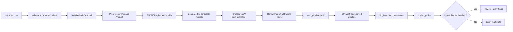
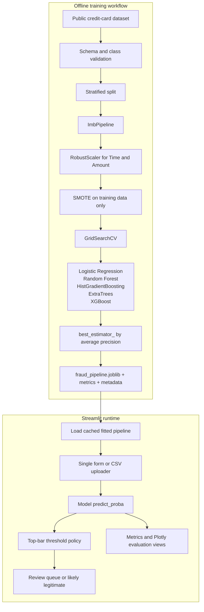

# 💳 CreditGuard — Credit-Card Fraud Detection

<p align="center">
  
  
  
</p>

<p align="center">
  <strong>A full-screen Streamlit risk console for screening anonymized card transactions, reviewing model confidence, and routing high-risk activity for investigation.</strong>
</p>

> **Important:** CreditGuard is an educational benchmark application. It is not a calibrated production fraud system, credit decision engine, or substitute for human review, regulatory controls, monitoring, access control, audit logging, or model governance.

## Product overview

CreditGuard converts the supplied imbalanced-dataset notebook into a reusable fraud-scoring product. It supports portfolio monitoring, single-transaction screening, batch CSV scoring, model evaluation, a green-focused security interface, and a top-level decision-threshold control for exploring operational trade-offs.

The inference layer is model-agnostic. Training compares five candidate classifiers inside a leakage-safe preprocessing and SMOTE workflow, selects `GridSearchCV.best_estimator_` using cross-validated average precision, refits the winner, and saves the complete fitted pipeline. Streamlit loads that artifact and calls `predict_proba()` without hardcoding the winning model.

## Technology stack

<div align="center">
  <a href="https://skillicons.dev">
    
  </a>
</div>

| Layer | Technologies | Responsibility |
| --- | --- | --- |
| User interface |   | Full-screen risk console, forms, batch upload, metrics, charts, and threshold controls |
| Data and features |    | CSV ingestion, schema validation, feature selection, and numerical transformations |
| Imbalance handling |  | SMOTE applied only inside training folds and the final training pipeline |
| Machine learning |   | Cross-validation, model comparison, metrics, preprocessing, and candidate classifiers |
| Packaging and delivery |  | Version control, artifact storage, and Streamlit Community Cloud deployment |

## Core capabilities

| Capability | Product behavior |
| --- | --- |
| **Portfolio overview** | Shows population size, fraud rate, average precision, ROC-AUC, selected model, class balance, and model-comparison results. |
| **Single screening** | Accepts `Time`, `Amount`, and anonymized `V1`–`V28` inputs, then returns a fraud probability and review decision. |
| **Batch scoring** | Scores a CSV, preserves optional `Class` labels, summarizes the review queue, and exports a scored CSV. |
| **Model evaluation** | Displays the confusion matrix, ROC curve, precision-recall curve, threshold reference table, and operating metrics. |
| **Decision policy** | The threshold slider is positioned in the full-width top control bar and is applied consistently to single and batch predictions. |
| **Production-style UI** | Uses a green security theme, credit-card branding, full-screen navigation, system status, and responsive risk panels. |

## End-to-end workflow



## System architecture



## Model selection and evaluation

The training workflow compares logistic regression, random forest, histogram gradient boosting, ExtraTrees, and XGBoost. The selection metric is cross-validated **average precision**, which is more informative than accuracy when fraud is rare. The winning pipeline is refit on the full training partition and evaluated once on the untouched stratified test partition.

The current benchmark selected `HistGradientBoostingClassifier` with these held-out test results:

| Metric | Result |
| --- | ---: |
| Average precision | **0.875** |
| ROC-AUC | **0.981** |
| Precision at 0.50 | **0.723** |
| Recall at 0.50 | **0.878** |
| F1 at 0.50 | **0.793** |

These values describe the supplied public benchmark and current validation design. They are not a guarantee of production performance. Real deployment would require temporal validation, calibration, drift monitoring, cost-sensitive threshold selection, access controls, audit trails, and human-review processes.

## Repository structure

| Path | Purpose |
| --- | --- |
| `app.py` | Full-screen green-themed Streamlit risk console with top navigation, threshold slider, scoring flows, and evaluation charts |
| `train_model.py` | Leakage-safe multi-model training, cross-validation, best-estimator selection, and artifact export |
| `models/fraud_pipeline.joblib` | Fitted preprocessing, SMOTE, and selected classifier pipeline used by Streamlit |
| `models/model_comparison.csv` | Cross-validation comparison of candidate models |
| `models/metadata.json` | Dataset, feature, model-selection, and training metadata |
| `models/metrics.json` | Held-out metrics and downsampled ROC/precision-recall curve data |
| `models/test_predictions.csv` | Held-out scores used by the evaluation page |
| `notebooks/credit-fraud-dealing-with-imbalanced-datasets.ipynb` | Original source notebook supplied for the project |
| `requirements.txt` | Local and Streamlit Community Cloud dependencies |

## Run locally

From the project root:

```bash
python3 -m venv .venv
source .venv/bin/activate
pip install -r requirements.txt
streamlit run app.py
```

To retrain the artifacts, place the public `creditcard.csv` at `data/creditcard.csv` and run:

```bash
python train_model.py --data data/creditcard.csv --output-dir models
```

The default `--smote-ratio 0.25` increases representation of the minority class while keeping local training practical. To reproduce a 50/50 SMOTE target closer to the notebook, use `--smote-ratio 1.0`.

## Deploy on Streamlit Community Cloud

1. Open [Streamlit Community Cloud](https://share.streamlit.io/).
2. Select the repository `Samarssj/Credit-Guard` and branch `main`.
3. Set `app.py` as the main file and deploy.
4. Streamlit installs the dependencies from `requirements.txt` and loads `models/fraud_pipeline.joblib`.
5. Do not commit the raw dataset unless redistribution is permitted. The default deployed experience only needs the model and evaluation artifacts.

## Dataset and input schema

The application uses the ULB credit-card fraud benchmark. It contains 284,807 transactions, including 492 fraud cases, with anonymized PCA-derived columns `V1`–`V28`, plus `Time`, `Amount`, and `Class`. The raw CSV is intentionally excluded from the repository. Download it from the public [Figshare mirror][1] or the original [Kaggle dataset page][2], review the source terms, and place it at `data/creditcard.csv` for training.

Batch scoring requires these 30 numeric feature columns:

```text
Time,V1,V2,V3,V4,V5,V6,V7,V8,V9,V10,V11,V12,V13,V14,V15,V16,V17,V18,V19,V20,V21,V22,V23,V24,V25,V26,V27,V28,Amount
```

A `Class` column may also be present for comparison; it is ignored during prediction and preserved in the downloaded output.

## References

[1]: https://figshare.com/articles/dataset/creditcard_Dataset/29270873 "Figshare: creditcard Dataset"
[2]: https://www.kaggle.com/datasets/mlg-ulb/creditcardfraud "Kaggle: Credit Card Fraud Detection"
[3]: https://fraud-detection-handbook.github.io/fraud-detection-handbook/Chapter_3_GettingStarted/SimulatedDataset.html "Fraud Detection Handbook"

The dataset description, class distribution, anonymized feature structure, and precision-recall evaluation context are documented by the public dataset sources [1] [2] and the Fraud Detection Handbook [3].
