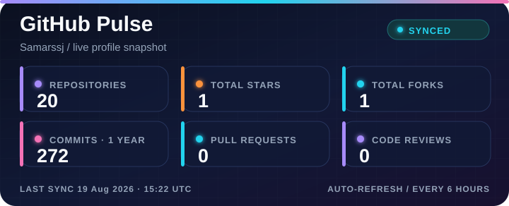
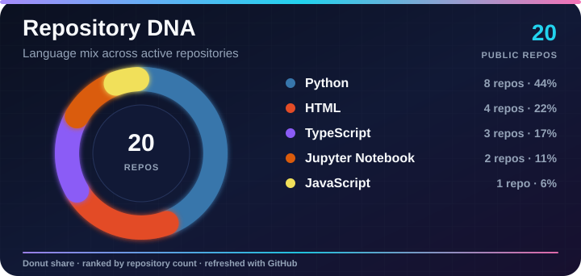
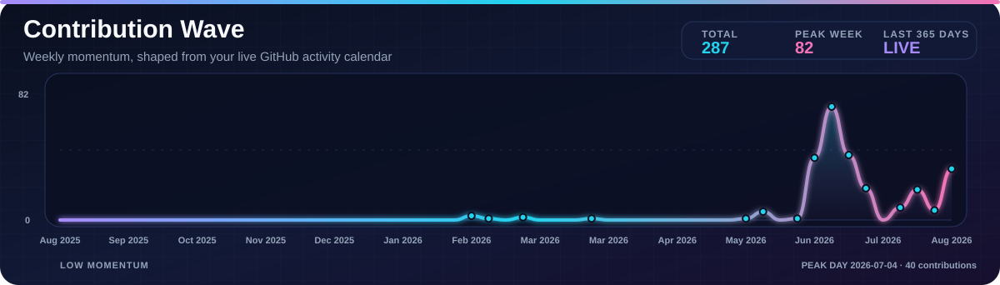
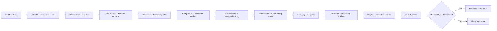
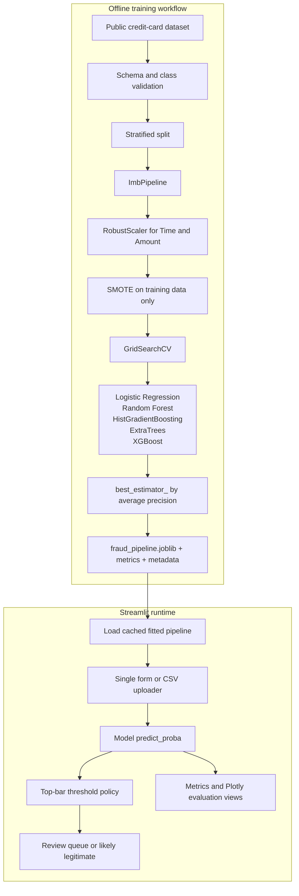

<div align="center">


# Hi there, I'm Samar Singh 👋

### AI Developer · Machine Learning Enthusiast · Builder of Intelligent Systems


<table align="center" border="0">
  <tr>
    <td align="center">
      <a href="https://samar-portfolio1.vercel.app" target="_blank">
        
      </a>
    </td>
    <td align="center">
      <a href="https://www.linkedin.com/in/samar-singh-3a4560289" target="_blank">
        
      </a>
    </td>
    <td align="center">
      <a href="https://github.com/Samarssj" target="_blank">
        
      </a>
    </td>
    <td align="center">
      
    </td>
  </tr>
</table>

</div>

---

## About Me

I am an **AI Developer and Machine Learning enthusiast** focused on building practical, intelligent systems. I enjoy working at the intersection of **psychology, natural language, cloud platforms, and software engineering**—exploring how human thinking can inspire better machine experiences.

At **EXL Services**, I work with technologies including **GCP, CX Agent Studio, Dialogflow CX, Vertex AI, Java, Node.js, MongoDB, Python, and machine learning**. I am continuously learning about automation, agentic AI, feature engineering, and predictive algorithms.

> *“The intersection of psychology and technology is where I believe the most exciting innovations happen.”*

## Current Focus

<div align="center">


</div>

## Technology Stack

<div align="center">

<a href="https://skillicons.dev">
  
</a>


<br />


</div>

## What I Work On

| Area | Focus |
| --- | --- |
| **AI & ML** | Agentic AI, NLP, feature engineering, predictive algorithms, and automation |
| **Cloud Engineering** | GCP, Cloud Run, Vertex AI, Docker, Kubernetes, and webhooks |
| **Application Development** | Java, Python, JavaScript, Node.js, REST APIs, and FastAPI |
| **Data & Storage** | MongoDB, Firestore, SQLite, vector databases, Pandas, NumPy, and Matplotlib |

## GitHub Analytics

<div align="center">


<br />

<hr />


<sub>Live GitHub data · automatically refreshed every 6 hours · last generated by GitHub Actions</sub>

</div>

## Let's Connect

<div align="center">

<a href="https://samar-portfolio1.vercel.app">
  
</a>

<br />

<a href="https://samar-portfolio1.vercel.app">Portfolio</a> ·
<a href="https://www.linkedin.com/in/samar-singh-3a4560289">LinkedIn</a> ·
<a href="https://github.com/Samarssj">GitHub</a>

<br />

**Always open to learning, collaborating, and building meaningful AI-powered solutions**

</div>

---

<div align="center">

<sub>Designed with curiosity, code, and a little bit of machine learning.</sub>

</div>


---

# 💳 CreditGuard — Credit-Card Fraud Detection

<p align="center">
  
  
  
</p>

<p align="center">
  <strong>A production-style Streamlit risk console for screening anonymized card transactions, reviewing model confidence, and routing high-risk activity for investigation.</strong>
</p>

> **Important:** CreditGuard is an educational benchmark application. It is not a calibrated production fraud system, credit decision engine, or substitute for human review, regulatory controls, monitoring, access control, audit logging, and model governance.

## Product overview

CreditGuard converts the supplied imbalanced-dataset notebook into a reusable fraud-scoring product. The application supports portfolio monitoring, single-transaction screening, batch CSV scoring, model evaluation, a full-screen green security interface, and a top-level decision-threshold control for exploring operational trade-offs.

The inference layer is intentionally model-agnostic. Training compares five candidate classifiers inside a leakage-safe preprocessing and SMOTE workflow, selects `GridSearchCV.best_estimator_` using cross-validated average precision, refits the winner, and saves the complete fitted pipeline. Streamlit then loads that artifact and calls `predict_proba()` without hardcoding the winning model.

## Technology stack

<div align="center">
  <a href="https://skillicons.dev">
    
  </a>
</div>

| Layer | Technologies | Responsibility |
| --- | --- | --- |
| User interface |   | Full-screen risk console, forms, batch upload, metrics, charts, and threshold controls |
| Data and features |    | CSV ingestion, schema validation, feature selection, and numerical transformations |
| Imbalance handling |  | SMOTE applied only inside the training folds and final training pipeline |
| Machine learning |   | Cross-validation, model comparison, metrics, preprocessing, and candidate classifiers |
| Packaging and delivery |  | Version control, artifact storage, and Streamlit Community Cloud deployment |

## Core capabilities

| Capability | Product behavior |
| --- | --- |
| **Portfolio overview** | Shows population size, fraud rate, average precision, ROC-AUC, selected model, class balance, and model-comparison results. |
| **Single screening** | Accepts `Time`, `Amount`, and anonymized `V1`–`V28` inputs, then returns a fraud probability and review decision. |
| **Batch scoring** | Scores a CSV, preserves optional `Class` labels, summarizes the review queue, and exports a scored CSV. |
| **Model evaluation** | Displays the confusion matrix, ROC curve, precision-recall curve, threshold reference table, and operating metrics. |
| **Decision policy** | The threshold slider is positioned in the full-width top control bar and is applied consistently to single and batch predictions. |

## End-to-end workflow



## System architecture



## Model selection and evaluation

The training workflow compares logistic regression, random forest, histogram gradient boosting, ExtraTrees, and XGBoost. The selection metric is cross-validated **average precision**, which is more informative than accuracy for a dataset where fraud is a rare class. The winning pipeline is refit on the full training partition and evaluated once on the untouched stratified test partition.

The current benchmark selected `HistGradientBoostingClassifier` with the following held-out test results:

| Metric | Result |
| --- | ---: |
| Average precision | **0.875** |
| ROC-AUC | **0.981** |
| Precision at 0.50 | **0.723** |
| Recall at 0.50 | **0.878** |
| F1 at 0.50 | **0.793** |

These values describe the supplied public benchmark and current validation design. They are not a guarantee of production performance. Real deployment would require temporal validation, calibration, drift monitoring, cost-sensitive threshold selection, access controls, audit trails, and human-review processes.

## Repository structure

| Path | Purpose |
| --- | --- |
| `app.py` | Full-screen green-themed Streamlit risk console with navigation, top threshold slider, scoring flows, and evaluation charts |
| `train_model.py` | Leakage-safe multi-model training, cross-validation, best-estimator selection, and artifact export |
| `models/fraud_pipeline.joblib` | Fitted preprocessing, SMOTE, and selected classifier pipeline used by Streamlit |
| `models/model_comparison.csv` | Cross-validation comparison of candidate models |
| `models/metadata.json` | Dataset, feature, model-selection, and training metadata |
| `models/metrics.json` | Held-out metrics and downsampled ROC/precision-recall curve data |
| `models/test_predictions.csv` | Held-out scores used by the evaluation page |
| `notebooks/credit-fraud-dealing-with-imbalanced-datasets.ipynb` | Original source notebook supplied for the project |
| `requirements.txt` | Local and Streamlit Community Cloud dependencies |

## Run locally

From the project root:

```bash
python3 -m venv .venv
source .venv/bin/activate
pip install -r requirements.txt
streamlit run app.py
```

To retrain the artifacts, place the public `creditcard.csv` at `data/creditcard.csv` and run:

```bash
python train_model.py --data data/creditcard.csv --output-dir models
```

The default `--smote-ratio 0.25` increases representation of the minority class while keeping local training practical. To reproduce a 50/50 SMOTE target closer to the notebook, use `--smote-ratio 1.0`.

## Deploy on Streamlit Community Cloud

1. Push this repository to GitHub with `app.py`, `requirements.txt`, and the committed `models/` artifacts.
2. Open [Streamlit Community Cloud](https://share.streamlit.io/), select `Samarssj/Credit-Guard`, and choose `app.py` as the main file.
3. Deploy. Streamlit installs the dependencies and loads `models/fraud_pipeline.joblib`.
4. Do not commit the raw dataset unless redistribution is permitted. The default deployed experience only needs the model and evaluation artifacts.

## Dataset and input schema

The application uses the ULB credit-card fraud benchmark. It contains 284,807 transactions, including 492 fraud cases, with anonymized PCA-derived columns `V1`–`V28`, plus `Time`, `Amount`, and `Class`. The raw CSV is intentionally excluded from the repository. Download it from the public [Figshare mirror][1] or the original [Kaggle dataset page][2], review the source terms, and place it at `data/creditcard.csv` for training.

Batch scoring requires these 30 numeric feature columns:

```text
Time,V1,V2,V3,V4,V5,V6,V7,V8,V9,V10,V11,V12,V13,V14,V15,V16,V17,V18,V19,V20,V21,V22,V23,V24,V25,V26,V27,V28,Amount
```

A `Class` column may also be present for comparison; it is ignored during prediction and preserved in the downloaded output.

## References

[1]: https://figshare.com/articles/dataset/creditcard_Dataset/29270873 "Figshare: creditcard Dataset"
[2]: https://www.kaggle.com/datasets/mlg-ulb/creditcardfraud "Kaggle: Credit Card Fraud Detection"
[3]: https://fraud-detection-handbook.github.io/fraud-detection-handbook/Chapter_3_GettingStarted/SimulatedDataset.html "Fraud Detection Handbook: Fraud Detection Handbook"


CreditGuard is a Streamlit web application created from the attached **Credit Fraud Dealing with Imbalanced Datasets** notebook. It turns the exploratory notebook workflow into a reusable application for model evaluation, single-transaction screening, and batch CSV scoring.

> **Important:** This is an educational benchmark application. It is not a calibrated production fraud system, a credit decision engine, or a substitute for human review, regulatory controls, monitoring, and model governance.

## What is included

| Component | Purpose |
| --- | --- |
| `app.py` | Streamlit interface with overview, single prediction, batch scoring, and evaluation pages |
| `train_model.py` | Leakage-safe training and artifact export script |
| `models/fraud_pipeline.joblib` | Fitted preprocessing + SMOTE + selected best-estimator pipeline |
| `models/metadata.json` | Dataset and training metadata consumed by the app |
| `models/metrics.json` | Test-set metrics, ROC curve, and precision-recall curve data |
| `models/test_predictions.csv` | Held-out test predictions used for threshold analysis |
| `models/model_comparison.csv` | Cross-validation comparison of candidate models |
| `requirements.txt` | Streamlit Cloud dependency specification |
| `notebooks/credit-fraud-dealing-with-imbalanced-datasets.ipynb` | Original source notebook supplied for the project |

## Modeling approach

The source notebook compares random undersampling, SMOTE, classical classifiers, and a simple neural network. The deployable app now compares logistic regression, random forest, histogram gradient boosting, ExtraTrees, and XGBoost inside the same preprocessing and SMOTE workflow. `GridSearchCV.best_estimator_` is selected using cross-validated average precision, refit on the complete training split, and saved as `models/fraud_pipeline.joblib`. Streamlit loads that artifact directly, so prediction automatically uses whichever candidate won model selection. This prevents the common leakage mistake of resampling before the train/test split.

Because fraud is a rare class, the app emphasizes **precision, recall, F1, ROC-AUC, average precision, and confusion matrices** rather than accuracy alone. The selected model is the best candidate under the configured cross-validation search; it is not a claim of theoretical maximum performance. Results can change with hyperparameters, validation design, feature engineering, calibration, temporal splits, and production data drift. The decision threshold is adjustable from the sidebar so users can explore the operational trade-off between catching more fraud and creating more review cases.

## Run locally

From the project root:

```bash
python3 -m venv .venv
source .venv/bin/activate
pip install -r requirements.txt
```

If you already have the public `creditcard.csv` file, place it at `data/creditcard.csv` and train the artifacts:

```bash
python train_model.py --data data/creditcard.csv --output-dir models
streamlit run app.py
```

The default training command uses `--smote-ratio 0.25`, which creates a meaningful minority-class representation while keeping local training faster than fully balancing a 284,807-row dataset. To reproduce a 50/50 SMOTE target closer to the original notebook, run:

```bash
python train_model.py --data data/creditcard.csv --output-dir models --smote-ratio 1.0
```

## Dataset

The application is based on the ULB credit-card fraud benchmark. The dataset contains 284,807 transactions, including 492 fraud cases, and has anonymized PCA-derived columns `V1`–`V28` plus `Time`, `Amount`, and `Class`. The repository intentionally does **not** commit the 143 MB CSV. Download it from the public [Figshare mirror](https://figshare.com/articles/dataset/creditcard_Dataset/29270873) or the original [Kaggle dataset page](https://www.kaggle.com/datasets/mlg-ulb/creditcardfraud), then place it at `data/creditcard.csv` for training. Review the source license and attribution terms before redistributing the data.

## Deploy on Streamlit Community Cloud

1. Push this repository to GitHub with `app.py`, `requirements.txt`, and the `models/` artifacts committed.
2. Open [Streamlit Community Cloud](https://share.streamlit.io/), select the repository, branch, and `app.py` as the main file.
3. Deploy. Streamlit Cloud installs the packages listed in `requirements.txt` and loads the committed `models/fraud_pipeline.joblib` artifact.
4. Do not upload the raw dataset unless you have confirmed that redistribution is permitted. The deployed app only needs the model and evaluation artifacts for its default experience.

A minimal GitHub sequence is:

```bash
git add app.py train_model.py requirements.txt .streamlit models notebooks data/README.md README.md
git commit -m "Build Streamlit credit fraud detection app"
git push origin main
```

## Input schema for batch scoring

A CSV for the batch-scoring page must include these 30 numeric columns:

```text
Time,V1,V2,V3,V4,V5,V6,V7,V8,V9,V10,V11,V12,V13,V14,V15,V16,V17,V18,V19,V20,V21,V22,V23,V24,V25,V26,V27,V28,Amount
```

A `Class` column may also be present for comparison, but it is ignored during prediction and preserved in the downloaded output.

## References

[1]: https://www.kaggle.com/datasets/mlg-ulb/creditcardfraud "Kaggle: Credit Card Fraud Detection"
[2]: https://figshare.com/articles/dataset/creditcard_Dataset/29270873 "Figshare: creditcard Dataset"
[3]: https://fraud-detection-handbook.github.io/fraud-detection-handbook/Chapter_3_GettingStarted/SimulatedDataset.html "Fraud Detection Handbook: Simulated Dataset"

The dataset description, class distribution, anonymized feature structure, and recommendation to use area under the precision-recall curve are documented by the original dataset source [1] and the public mirror [2]. The broader methodological context for realistic fraud-detection evaluation is available in the Fraud Detection Handbook [3].
